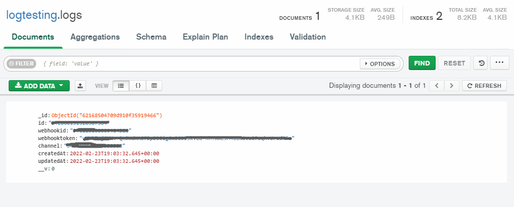
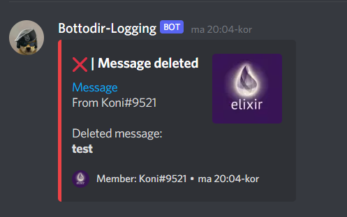

<p align="center">
  <a href="https://discord.gg/3eNaWPhWZE" target="blank"></a>
</p>

# Logging
This guide will explain you how to create a logging system for your Discord.js Bot.

## Requirements
* Basic Knowledge of JavaScript/NodeJS
* Basic+ Knowledge of MongoDB/Mongoose
* Basic+ experience with NPM
* Good experience with Discord.js
* A working connection to MongoDB with Schemas

Discord.js v13 or higher.
Nodejs v16 or higher.

Understanding Pathing
```
/ = Root directory.
. = This location.
.. = Up a directory.
./ = Current directory.
../ = Parent of current directory.
../../ = Two directories backwards.
```

## Get started
Lets get started by installing some dependencies, open your favourite terminal.
Run the following Commands in your Terminal.
```shell
npm install discord.js@latest
npm install mongoose
```
Close your terminal, we won't need it while coding.
The next steps are very easy. Create a folder called
`schemas`, the path would look like this: `src/models`.
In there, create a file called `logging.js`.

We now want Mongoose to store the Data we generate.
```js
const { Schema, Types, model } = require("mongoose");

const logSchema = new Schema({
    id:
    {
        type: String,
        unique: true,
        required: true
    },
    role:
    {
        type: String,
        required: false
    },
    webhookid:
    {
        type: String,
        required: true 
    },
    webhooktoken:
    {
        type: String,
        required: true 
    },
    channel:
    {
        type: String,
        required: true
    },
}, { timestamps: true });

const Log = model("Log", logSchema);

module.exports = Log;
```
Awesome. This allows us to save data to our database.
Now let's create the command to setup our Logging.

> src/commands/Logging/setup.js
```js
"use strict";

const { SlashCommandBuilder } = require("@discordjs/builders");
const { CommandInteraction, Permissions } = require("discord.js");

// The path to our schema
const Guild = require("../../models/logging");

module.exports.cooldown = {
    length: 10000, /* in ms */
    users: new Set()
};

/**
 * Runs ping command.
 * @param {CommandInteraction} interaction The Command Interaciton
 * @param {any} utils Additional util
 */
module.exports.run = async (interaction, utils) =>
{
    try
    {
      
        // Find the guild in the database
        const isSetup = await Guild.findOne({ id: interaction.guild.id });
        const channel = interaction.options.getChannel("channel") || interaction.channel;
    
        // If the guild has no setup done, go ahead.
        if (!isSetup) {
          if (channel.type != "GUILD_TEXT") {
            interaction.reply({
              content: `:x: | This is not a valid text channel!`,
              ephemeral: true,
            });
            return;
          }
    
          // Lets create a new webhook to send logging messages
          let webhookid;
          let webhooktoken;
    
          // You can change the name and the avatar link
          let newwebhook = await channel
            .createWebhook("Bot-Logging", {
              avatar:
                "https://media.discordapp.net/attachments/937076782404878396/941768103807840336/Zofia_Hund_R6.jpg?width=664&height=648",
            })
            .then((webhook) => {
              webhookid = webhook.id;
              webhooktoken = webhook.token;
            });
    
          // Save the guild and the webhook credentials in the database
          const newLogs = new Guild({
            id: interaction.guild.id,
            channel: channel.id,
            webhookid: webhookid,
            webhooktoken: webhooktoken,
          });
          newLogs.save();
    
          // return a success message
          interaction.reply({
            content: `Successfully set the logging Channel to ${channel}`,
            ephemeral: true,
          });
        }
    }
    catch (err)
    {
        return Promise.reject(err);
    }
};

module.exports.permissions = {
    clientPermissions: [Permissions.FLAGS.SEND_MESSAGES],
    userPermissions: [Permissions.FLAGS.ADMINISTRATOR]
};

module.exports.data = new SlashCommandBuilder()
    .setName("setup")
    .setDescription("Setup logging")
    .addChannelOption((option) =>
    option
      .setName("channel")
      .setDescription("Select the channel to send log messages")
      .setRequired(false)
  )
```
Easy, right?
This will save all of guilds data in the database.
Now we want to test our command and database.

```
$ npm run deploy
$ npm run dev

Bot is online!
```
> Testing the command
* Run `/setup` and choose a text channel
Now you should see something like `Successfully set the logging Channel to <channel>`.
Perfect, now open MongoDB Compass and login with your connection string.


If you see something like this, everything worked perfectly.

Lets check the channel settings, you will see a webhook integration added there.
If that's the case, you are one step closer.

The next step is to create some events, our first event will be called
`messageDelete.js`
Create a file within your events folder called `messageDelete.js`.
The path would look like this: `src/events/messageDelete.js`.

```js
"use strict";

const { GuildMember, MessageEmbed, WebhookClient } = require("discord.js");

// Database queries
const Guild = require("../models/logging");

module.exports.data = {
  name: "messageDelete",
  once: false,
};

/**
 * Handle the clients event.
 * @param {GuildMember} member The client that triggered the event.
 * @param {CommandInteraction} interaction The Command Interaciton
 */

module.exports.run = async (message) => {
  try {
    
    // If the author is a bot, dont do anything.
    if(message.author.bot) return;

    const embed = new MessageEmbed()
      .setTitle(`:x: | Message deleted`)
      .setDescription(`[Message](${message.url})\nFrom ${message.author.tag}\n\nDeleted message:\n**${message.content ? message.content : "None"}**`.slice(0, 4096))
      .setColor("RED")
      .setTimestamp()
      .setThumbnail(message.author.displayAvatarURL({ dynamic: true }))
      .setFooter({ text: `Member: ${message.author.tag}`, iconURL: message.author.displayAvatarURL({ dynamic: true })})
    

    // Query the database for the Guilds Settings (Channel)
    const guildQuery = await Guild.findOne({ id: message.guild.id });
    if (!guildQuery) return;

    // If there is a setup within the guild, log the message with a cool looking embed defined above.
    if (guildQuery) {
      const webhookid = guildQuery.webhookid;
      const webhooktoken = guildQuery.webhooktoken;

      const webhookClient = new WebhookClient({ id: webhookid, token: webhooktoken });
    
      webhookClient.send({ embeds: [embed]});
    }
  } catch (err) {
    return Promise.reject(err);
  }
};
```
Lets test this out.
Reload your bot and go back to your server.
Send any message and then delete it.


     
🎉 You have successfully setup logging for you discord bot!
You can now go ahead and add more events.
You can read through every event [here](https://discord.js.org/#/docs/discord.js/stable/class/Client)
