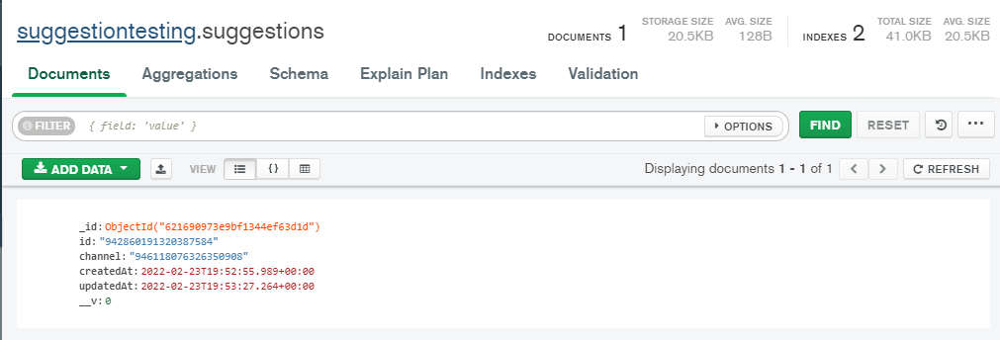
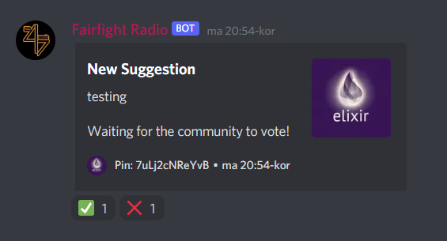
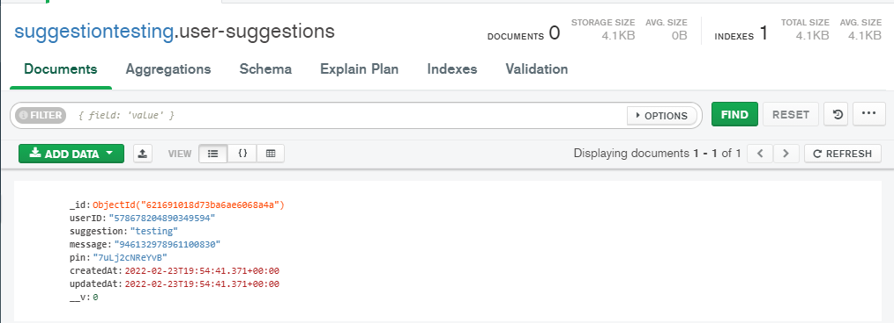
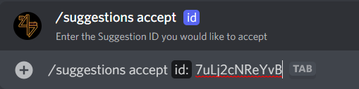
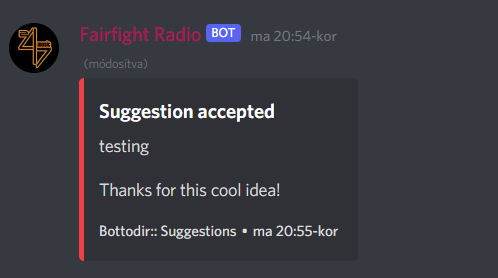

<p align="center">
  <a href="https://discord.gg/3eNaWPhWZE" target="blank"></a>
</p>

# Suggestions
This guide will explain you how to create an advanced suggestion system for your Discord.js Bot.

## Requirements
* Basic Knowledge of JavaScript/NodeJS
* Basic+ Knowledge of MongoDB/Mongoose
* Basic+ experience with NPM
* Good experience with Discord.js
* A working connection to MongoDB with Schemas

Discord.js v13 or higher.
Nodejs v16 or higher.

Understanding Pathing
```
/ = Root directory.
. = This location.
.. = Up a directory.
./ = Current directory.
../ = Parent of current directory.
../../ = Two directories backwards.
```

## Get started
Lets get started by installing some dependencies, open your favourite terminal.
Run the following Commands in your Terminal.
```shell
npm install discord.js@latest
npm install mongoose
```
Close your terminal, we won't need it while coding.
The next steps are very easy. 
For this tutorial, we will modify our interactionCreate event a bit.

```js
const args = [];

    for (let option of interaction.options.data) {
      if (option.type === "SUB_COMMAND") {
        if (option.name) args.push(option.name);
        option.options?.forEach((x) => {
          if (x.value) args.push(x.value);
        });
      } else if (option.value) args.push(option.value);
    }
```
This allows us to have options on our commands.
Full example [here](https://github.com/vKxni/disco.js/blob/main/Suggestions/src/events/interactionCreate.js)

Now let's start coding our suggestion system.

> Create a folder called
`schemas`, the path would look like this: `src/models`.
In there, create a file called `suggestions.js`.
The path would look like this: `src/models/suggestions.js`

We now want Mongoose to store the suggestion setup we generate within the guild.
```js
const { Schema, Types, model } = require("mongoose");

const suggestionSchema = new Schema({
    id:
    {
        type: String,
        unique: true,
        required: true
    },
    channel:
    {
        type: String,
        required: true
    },
}, { timestamps: true });

const Suggestion = model("Suggestion", suggestionSchema);

module.exports = Suggestion
```
We also need a User schema to store custom suggestions.
The file will be called `usersuggestions.js`
```js
const { Schema, Types, model } = require("mongoose");

const userSugSchema = new Schema({
    userID:    {
        type: String,
    },
    suggestion:
    {
        type: String
    },
    message: {
        type: String
    },
    pin:
    {
        type: String
    }
}, { timestamps: true });

const userSuggestions = model("user-suggestions", userSugSchema);

module.exports = userSuggestions
```
Awesome. This allows us to save data to our database.

Now let's create the command to setup our suggestions.

> src/commands/Suggestions/suggestion.js
```js
"use strict";

const { SlashCommandBuilder } = require("@discordjs/builders");
const { CommandInteraction, MessageEmbed } = require("discord.js");

// Database queries
const Guild = require("../../models/suggestions");

module.exports.cooldown = {
  length: 10000,
  users: new Set(),
};

/**
 * @param {CommandInteraction} interaction
 */

module.exports.run = async (interaction) => {
  
    // Check if the guild has some data in the database.
    const guildQuery = await Guild.findOne({ id: interaction.guild.id });
    const channel = interaction.options.getChannel("channel") || interaction.channel;

    // If not data, create new data.
    if (!guildQuery) {
      const newLogs = new Guild({
        id: interaction.guild.id,
        channel: channel.id,
      });
      newLogs.save();
      interaction.reply({
        content: `Successfully set the suggestion channel to ${channel}`,
        ephemeral: true,
      });
      
    // We want the user to change the channel any time
    // This is a huge quality of live ad-on
    } else {
      if (channel.type != "GUILD_TEXT") {
        interaction.reply({
          content: `This is not a valid channel!`,
          ephemeral: true,
        });
        return;
      }
  
      // Update the guilds channel to the new mentioned channel
      await Guild.findOneAndUpdate({
        id: interaction.guild.id,
        channel: channel.id,
      });
      interaction.reply({
        content: `Successfully changed suggestion channel to ${channel}`,
        ephemeral: true,
      });
    }
  
};

module.exports.data = new SlashCommandBuilder()
  .setName("suggestion")
  .setDescription("Setup/Remove suggestions")
  .addChannelOption((option) =>
        option
          .setName("channel")
          .setDescription("Select the channel for sending suggestions.")
          .setRequired(false)
      )
  
```
Easy, right?
This will save all of guilds data in the database.
Now we want to test our command and check the database query.

```
$ npm run deploy
$ npm run dev

Bot is online!
```
> Testing the command
* Run `/suggestion` and choose a text channel.
Now you should see something like `Successfully set the suggestion channel to <channel>`.
Perfect, now open MongoDB Compass and login with your connection string.


If you see something like this, everything worked perfectly.

The next step is to create some utility command, our first command will be called
`suggest.js`.
Create a file within your commands folder called `suggest.js`.
The path would look like this: `src/commands/Suggestion/suggest.js`.

```js
"use strict";

const { SlashCommandBuilder } = require("@discordjs/builders");
const { CommandInteraction, Permissions, MessageEmbed } = require("discord.js");

// Database queries
const Guild = require("../../models/suggestions");
const User = require("../../models/usersuggestions");

module.exports.cooldown = {
    length: 320000, /* in ms */
    users: new Set()
};

// generate random ID
function generateID() {
    var length = 12,
        charset = "abcdefghijklmnopqrstuvwxyzABCDEFGHIJKLMNOPQRSTUVWXYZ0123456789",
        retVal = "";
    for (var i = 0, n = charset.length; i < length; ++i) {
        retVal += charset.charAt(Math.floor(Math.random() * n));
    }
    return retVal;
}

/**
 * Runs the command.
 * @param {CommandInteraction} interaction The Command Interaciton
 * @param {any} utils Additional util
 */
module.exports.run = async (interaction) =>
{
    try
    {
    
        // Chef is the guild is within the database
        const guildQuery = await Guild.findOne({ id: interaction.guild.id })
        if(!guildQuery) return interaction.reply({ content: `This guild has **no** suggestion system setup.`, ephemeral: true })
        
        // Some variables
        const suggestion = interaction.options.getString("suggestion")
        const pin = generateID(); // generate a random ID
        const user = interaction.user;

        if(suggestion.length >= 150) return interaction.reply({ content: `Description must be less than **150** characters.`, ephemeral: true })

        const embed = new MessageEmbed()
        .setTitle(`New Suggestion`)
        .setDescription(`${suggestion}\n\nWaiting for the community to vote!`)
        .setTimestamp()
        .setFooter({ text: `Pin: ${pin}`, iconURL: interaction.user.displayAvatarURL({ dynamic: true })})
        .setThumbnail(interaction.user.displayAvatarURL({ dynamic: true }))
        .setColor("#36393F")

        // If guild has some data, save the suggestion including message + id in the database
        // Send the message into the channel and react with upvote/downvote emojis
        // Feel free to change them if you want.
        if(guildQuery) {
            const guild = interaction.client.guilds.cache.get(interaction.guild.id);
            const suggestionchannel = guild.channels.cache.get(guildQuery.channel);
            const message = await suggestionchannel.send({ embeds: [embed] }); 

            // As mentioned above, save the suggestion under the users ID
            const userSuggestion = new User({
                userID: interaction.user.id,
                suggestion: suggestion,
                message: message.id,
                pin: pin
            })
            userSuggestion.save();

            await message.react(`✅`)
            await message.react(`❌`)

            interaction.reply({ content: `Successfully sent suggestion.`, ephemeral: true, fetchReply: true });
        }
    }
    catch (err)
    {
        return Promise.reject(err);
    }
};

module.exports.permissions = {
    clientPermissions: [Permissions.FLAGS.SEND_MESSAGES],
    userPermissions: [Permissions.FLAGS.SEND_MESSAGES]
};

module.exports.data = new SlashCommandBuilder()
    .setName("suggest")
    .setDescription("Suggest some Ideas for the Server.")
    .addStringOption(option => option.setName("suggestion").setDescription("Provide the reason for the ban, add proofs via Imgur.").setRequired(true))
```
Lets test this out.
Reload your bot and go back to your server.
Type `/suggest <message>`.
If everything worked, you will see a message in the channel


     
Awesome!

If you check your database, you will see a user-suggestion there.



We will now create a command to deny/accept a suggestion.
Path: `src/commands/Suggestion/suggestions.js`
```js
"use strict";

const { SlashCommandBuilder } = require("@discordjs/builders");
const { CommandInteraction, MessageEmbed } = require("discord.js");

// Database queries
const Guild = require("../../models/suggestions"); // For guild
const UserSuggestion = require("../../models/usersuggestions"); // Users suggestions

module.exports.cooldown = {
  length: 10000,
  users: new Set(),
};

/**
 * @param {CommandInteraction} interaction
 */

module.exports.run = async (interaction) => {
  await interaction.deferReply();
  const sub = interaction.options.getSubcommand();

  // Adding a sub command to accept suggestion
  if (sub === "accept") {
    const suggestionid = interaction.options.getString("id");

    // Query the guild and the user for the suggestions
    const guildQuery = await Guild.findOne({ id: interaction.guild.id });
    const suggestionQuery = await UserSuggestion.findOne({ pin: suggestionid });

    // Get the suggestion (message)
    const suggestionmessage = suggestionQuery.suggestion;

    // if no guild setup, dont execute it.
    if (!guildQuery)
      return interaction.reply({
        content: `No suggestion setup found`,
        ephemeral: true,
      });

    // if suggestion id is wrong, return an error.
    if (!suggestionQuery)
      return interaction.reply({
        content: `No suggestion found with that ID.`,
        ephemeral: true,
      });

    // if the channel cannot be found, return an error.
    const schannel = interaction.guild.channels.cache.get(guildQuery.channel);
    if (!schannel)
      return interaction.reply(
        `No suggestion channel found.`
      );

    const embed = new MessageEmbed()
      .setTitle(`Suggestion accepted`)
      .setDescription(`${suggestionmessage}\n\nThanks for this cool idea!`)
      .setColor("RED")
      .setFooter({
        text: `Bot:: Suggestions`,
        iconURL: interaction.guild.iconURL({ dynamic: true }),
      })
      .setThumbnail(interaction.guild.iconURL({ dynamic: true }))
      .setTimestamp();

    // Fetch the message, edit it and remove all reactions
    const message = suggestionQuery.message;

    await schannel.messages.fetch(message).then((editm) => {
      editm.edit({ embeds: [embed] });
      editm.reactions.removeAll();
    });

    // Delete suggestion from database.
    suggestionQuery.delete();

    interaction.followUp({
      content: `Suggestion successfully **accepted**!`,
      ephemeral: true,
    });
    
    // Adding a sub command to deny suggestion
  } else if (sub === "deny") {
    const suggestionid = interaction.options.getString("id");

    // Query the guild and the user for the suggestions
    const guildQuery = await Guild.findOne({ id: interaction.guild.id });
    const suggestionQuery = await UserSuggestion.findOne({ pin: suggestionid });

    // Get the suggestion (message)
    const suggestionmessage = suggestionQuery.suggestion;

    // the same as above
    if (!guildQuery)
      return interaction.reply({
        content: `No suggestion setup found`,
        ephemeral: true,
      });

    // the same as above
    if (!suggestionQuery)
      return interaction.reply({
        content: `No suggestion found with that ID.`,
        ephemeral: true,
      });

    // the same as above
    const schannel = interaction.guild.channels.cache.get(guildQuery.channel);
    if (!schannel)
      return interaction.reply(
        `No suggestion channel found.`
      );

    const embed = new MessageEmbed()
      .setTitle(`Suggestion denied`)
      .setDescription(
        `${suggestionmessage}\n\nSadly, this suggestion is not good enough.`
      )
      .setColor("RED")
      .setFooter({
        text: `Bot:: Suggestions`,
        iconURL: interaction.guild.iconURL({ dynamic: true }),
      })
      .setThumbnail(interaction.guild.iconURL({ dynamic: true }))
      .setTimestamp();

    // Fetch the message, edit it and remove all reactions
    const message = suggestionQuery.message;

    await schannel.messages.fetch(message).then((editm) => {
      editm.edit({ embeds: [embed] });
      editm.reactions.removeAll();
    });

    // Delete suggestion from database.
    suggestionQuery.delete();

    interaction.followUp({
      content: `Suggestion successfully **denied**!`,
      ephemeral: true,
    });
  }
};

module.exports.data = new SlashCommandBuilder()
  .setName("suggestions")
  .setDescription("Accept or deny a suggestion")
  .addSubcommand((sub) =>
    sub
      .setName("accept")
      .setDescription("Accept a suggestion")
      .addStringOption((option) =>
        option
          .setName("id")
          .setDescription("Enter the Suggestion ID you would like to accept")
          .setRequired(true)
      )
  )
  .addSubcommand((sub) =>
    sub
      .setName("deny")
      .setDescription("Deny a suggestion")
      .addStringOption((option) =>
        option
          .setName("id")
          .setDescription("Enter the Suggestion ID you would like to accept")
          .setRequired(true)
      )
  );
```
Awesome, now reload your Bot and run the following command.
`/suggestions accept <id>`



Hit enter, now you will see the embed being edited.



🎉 You have successfully created an advanced suggestion system.
